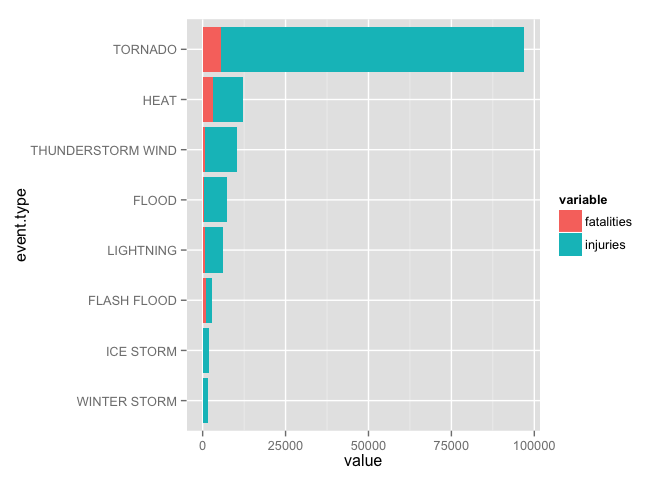
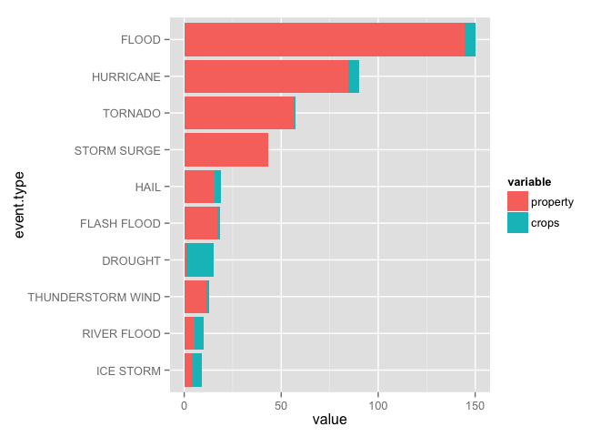

# Social and Economic Consequences of Severe Weather Events in U.S.
Ion Scerbatiuc  
May 22, 2015  

## Synopsis

TDB

## Data Processing

For this analysis we use the following libraries as dependencies and hence they have to be loaded into the environment.


```r
library(dplyr)
library(ggplot2)
library(reshape2)
```

### Downloading the data

The compressed data file is located on the Reproducible Reasearch course storage location, for convenience, so we need to first download it from there.


```r
if (!file.exists("StormData.csv.bz2")) {
    download.file(
        "https://d396qusza40orc.cloudfront.net/repdata%2Fdata%2FStormData.csv.bz2", 
        destfile = "StormData.csv.bz2", 
        method = "curl")
}
```

### Loading and cleaning the data

Let's first load the raw data from the downloaded archive file.


```r
storm_data_raw <- read.csv(bzfile("StormData.csv.bz2"), stringsAsFactors = FALSE)
```

Next let's clean the data and select only the relevant columns and rows for this analysis. Since the purpose of the analysis is to identify the social and economic impact of the weather events, we need only the columns that have values in the corresponding columns: `FATALITIES`, `INJURIES`, `PROPDMG` and `CROPDMG`.


```r
storm_data <- storm_data_raw %>%
    filter(FATALITIES > 0 | INJURIES > 0 | PROPDMG > 0 | CROPDMG > 0) %>%
    transmute(
        event.type=EVTYPE, fatalities=FATALITIES, injuries=INJURIES,
        damage.p=PROPDMG, damage.p.multiplier=toupper(PROPDMGEXP),
        damage.c=CROPDMG, damage.c.multiplier=toupper(CROPDMGEXP))
```

#### Cleaning the damage amounts

The damage amounts are specified as raw values and multipliers. The expected multipliers are: empty, H, K, M and B. Any other values are unknown or invalid. Let's see how many of those we have:


```r
valid.multipliers <- c("", "H", "K", "M", "B")

table(with(storm_data, 
           damage.p.multiplier %in% valid.multipliers & 
               damage.c.multiplier %in% valid.multipliers))
```

```
## 
##  FALSE   TRUE 
##    269 254364
```

We can see that the number of observations with unknown multipliers is very low comparative to the total number of events. Let's assume that these values do no change the overall statistics and hence we can remove the observations from our analysis. 


```r
storm_data <- storm_data %>% filter(
    damage.p.multiplier %in% valid.multipliers,
    damage.c.multiplier %in% valid.multipliers)
```

Now, let's compute the absolute dolar amounts for the remaining observations:


```r
as.multiplier <- function(char) {
    multipliers <- c(1e2, 1e3, 1e6, 1e9)
    names(multipliers) <- c("H", "K", "M", "B")
    ifelse (char %in% names(multipliers), multipliers[char], 1)
}

storm_data <- storm_data %>%
    mutate(
        damage.p = damage.p * as.multiplier(damage.p.multiplier),
        damage.c = damage.c * as.multiplier(damage.c.multiplier)) %>%
    select(-damage.p.multiplier, -damage.c.multiplier)
```

#### Cleaning event types

The `EVTYPE` column is very messy, so let's try and clean it up a little bit.

First, there are a lot of variation of `THUNDERSTORM WINDS` like `TSTM WIND`, `TSTM WIND (G45)` and so on. Let's unify all those records under a single value.


```r
pattern = "T[^S]*S[^T]*T[^M]*M WIND(S?)"
storm_data[grep(pattern, storm_data$event.type), ]$event.type <- "THUNDERSTORM WIND"
```

A few other categories of event types have also duplicates. Let's normalize them to a single value.


```r
storm_data[grep("HEAT", storm_data$event.type), ]$event.type <- "HEAT"
storm_data[grep("HURRICANE", storm_data$event.type), ]$event.type <- "HURRICANE"
storm_data[grep("FLASH FLOOD", storm_data$event.type), ]$event.type <- "FLASH FLOOD"
```

#### Building the clean dataset

In order to interpret the results of our analysis, we need two clean datasets: number of casualties by event type and the damage amounts by event type.


```r
casualties <- storm_data %>%
    group_by(event.type) %>%
    summarise(
        fatalities = sum(fatalities),
        injuries = sum(injuries),
        totals = sum(fatalities + injuries)) %>%
    filter(totals > 0) %>%
    arrange(-totals)
casualties$event.type <- factor(
    casualties$event.type,
    levels = rev(casualties$event.type))
head(casualties, n = 10)
```

```
## Source: local data frame [10 x 4]
## 
##           event.type fatalities injuries totals
## 1            TORNADO       5630    91321  96951
## 2               HEAT       3138     9154  12292
## 3  THUNDERSTORM WIND        753     9492  10245
## 4              FLOOD        470     6789   7259
## 5          LIGHTNING        816     5230   6046
## 6        FLASH FLOOD       1035     1802   2837
## 7          ICE STORM         89     1975   2064
## 8       WINTER STORM        206     1321   1527
## 9          HURRICANE        135     1326   1461
## 10         HIGH WIND        246     1137   1383
```


```r
damage <- storm_data %>%
    group_by(event.type) %>%
    summarise(
        property = sum(damage.p) / 1e9,
        crops = sum(damage.c) / 1e9,
        totals = sum(damage.p + damage.c) / 1e9) %>%
    filter(totals > 0) %>%
    arrange(-totals)
damage$event.type <- factor(
    damage$event.type,
    levels = rev(damage$event.type))
head(damage, n = 10)
```

```
## Source: local data frame [10 x 4]
## 
##           event.type   property      crops     totals
## 1              FLOOD 144.657710  5.6619684 150.319678
## 2          HURRICANE  84.756180  5.5152928  90.271473
## 3            TORNADO  56.936985  0.3649501  57.301936
## 4        STORM SURGE  43.323536  0.0000050  43.323541
## 5               HAIL  15.732262  3.0009545  18.733217
## 6        FLASH FLOOD  16.906008  1.5316071  18.437615
## 7            DROUGHT   1.046106 13.9725660  15.018672
## 8  THUNDERSTORM WIND  11.366567  1.2559504  12.622518
## 9        RIVER FLOOD   5.118945  5.0294590  10.148404
## 10         ICE STORM   3.944928  5.0221100   8.967038
```

## Results

In order to interpret the results we will select only the most impactful event types; the ones that account for more than 90% of all the casualties / damage respectively


```r
threshold = 0.9
```

### Social Consequences

Let's first plot the number of casualties by event type for the most impactiful events.


```r
worst.indexes <- cumsum(casualties$totals) < threshold * sum(casualties$totals)
worst.casualties <- casualties[worst.indexes, ] %>% 
    select(-totals) %>% 
    melt(id.vars = c("event.type"))

ggplot(worst.casualties, aes(x = event.type, y = value, fill = variable)) +
    geom_bar(stat='identity') + 
    coord_flip()
```

 

TBD

### Econimic Consequences

Let's first plot the damage amounts by event type for the most impactiful events.


```r
worst.indexes <- cumsum(damage$totals) < threshold * sum(damage$totals)
worst.damage <- damage[worst.indexes, ] %>% 
    select(-totals) %>% 
    melt(id.vars = c("event.type"))

ggplot(worst.damage, aes(x = event.type, y = value, fill = variable)) +
    geom_bar(stat='identity') + 
    coord_flip()
```

 

TBD
