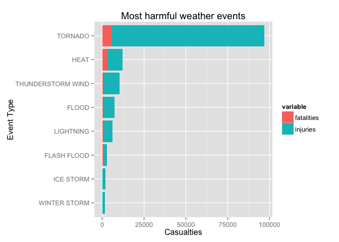
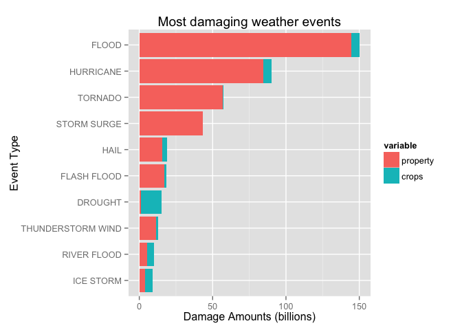

# Social and Economic Consequences of Severe Weather Events in U.S.
Ion Scerbatiuc  
May 22, 2015  

## Synopsis

Using the data from the U.S. National Oceanic and Atmospheric Administration’s (NOAA) storm database, we were able to identify the social and economical consequences of severe weather events in U.S. Between 1950-01-03 and 2011-11-30, there were observed 902297 severe weather events that caused over **155 thousands** casualties and **$476 bln** in property and crops damages. The following sections will drill down into the available data and will extract some interesting statistics about these events.

## Data Processing

For this analysis we use the following libraries as dependencies and hence they have to be loaded into the environment.


```r
library(xtable)
library(dplyr)
library(ggplot2)
library(reshape2)
```

### Downloading the data

The compressed data file is located on the Reproducible Reasearch course storage location, for convenience, so we need to first download it from there.


```r
if (!file.exists("StormData.csv.bz2")) {
    download.file(
        "https://d396qusza40orc.cloudfront.net/repdata%2Fdata%2FStormData.csv.bz2", 
        destfile = "StormData.csv.bz2", 
        method = "curl")
}
```

### Loading and cleaning the data

Let's first load the raw data from the downloaded archive file.


```r
storm_data_raw <- read.csv(bzfile("StormData.csv.bz2"), stringsAsFactors = FALSE)
```

Next let's clean the data and select only the relevant columns and rows for this analysis. Since the purpose of the analysis is to identify the social and economic impact of the weather events, we need only the columns that have values in the corresponding columns: `FATALITIES`, `INJURIES`, `PROPDMG` and `CROPDMG`.


```r
storm_data <- storm_data_raw %>%
    filter(FATALITIES > 0 | INJURIES > 0 | PROPDMG > 0 | CROPDMG > 0) %>%
    transmute(
        event.type=EVTYPE, fatalities=FATALITIES, injuries=INJURIES,
        damage.p=PROPDMG, damage.p.multiplier=toupper(PROPDMGEXP),
        damage.c=CROPDMG, damage.c.multiplier=toupper(CROPDMGEXP))
```

#### Cleaning the damage amounts

The damage amounts are specified as raw values and multipliers. The expected multipliers are: empty, H, K, M and B. Any other values are unknown or invalid. Let's see how many of those we have:


```r
valid.multipliers <- c("", "H", "K", "M", "B")

table(with(storm_data, 
           damage.p.multiplier %in% valid.multipliers & 
               damage.c.multiplier %in% valid.multipliers))
```

```
## 
##  FALSE   TRUE 
##    269 254364
```

We can see that the number of observations with unknown multipliers is very low comparative to the total number of events. Let's assume that these values do no change the overall statistics and hence we can remove the observations from our analysis. 


```r
storm_data <- storm_data %>% filter(
    damage.p.multiplier %in% valid.multipliers,
    damage.c.multiplier %in% valid.multipliers)
```

Now, let's compute the absolute dolar amounts for the remaining observations:


```r
as.multiplier <- function(char) {
    multipliers <- c(1e2, 1e3, 1e6, 1e9)
    names(multipliers) <- c("H", "K", "M", "B")
    ifelse (char %in% names(multipliers), multipliers[char], 1)
}

storm_data <- storm_data %>%
    mutate(
        damage.p = damage.p * as.multiplier(damage.p.multiplier),
        damage.c = damage.c * as.multiplier(damage.c.multiplier)) %>%
    select(-damage.p.multiplier, -damage.c.multiplier)
```

#### Cleaning event types

The `EVTYPE` column is very messy, so let's try and clean it up a little bit.

First, there are a lot of variation of `THUNDERSTORM WINDS` like `TSTM WIND`, `TSTM WIND (G45)` and so on. Let's unify all those records under a single value.


```r
pattern = "T[^S]*S[^T]*T[^M]*M WIND(S?)"
storm_data[grep(pattern, storm_data$event.type), ]$event.type <- "THUNDERSTORM WIND"
```

A few other categories of event types have also duplicates. Let's normalize them to a single value.


```r
storm_data[grep("HEAT", storm_data$event.type), ]$event.type <- "HEAT"
storm_data[grep("HURRICANE", storm_data$event.type), ]$event.type <- "HURRICANE"
storm_data[grep("FLASH FLOOD", storm_data$event.type), ]$event.type <- "FLASH FLOOD"
```

#### Building the clean dataset

In order to interpret the results of our analysis, we need two clean datasets: number of casualties by event type and the damage amounts by event type.


```r
casualties <- storm_data %>%
    group_by(event.type) %>%
    summarise(
        fatalities = sum(fatalities),
        injuries = sum(injuries),
        totals = sum(fatalities + injuries)) %>%
    filter(totals > 0) %>%
    arrange(-totals)
casualties$event.type <- factor(
    casualties$event.type,
    levels = rev(casualties$event.type))
```


```r
damage <- storm_data %>%
    group_by(event.type) %>%
    summarise(
        property = sum(damage.p) / 1e9,
        crops = sum(damage.c) / 1e9,
        totals = sum(damage.p + damage.c) / 1e9) %>%
    filter(totals > 0) %>%
    arrange(-totals)
damage$event.type <- factor(
    damage$event.type,
    levels = rev(damage$event.type))
```

## Results

### Social Consequences


```r
casualties.summary <- summarise(
    casualties, 
    fatalities = sum(fatalities), 
    injuries = sum(injuries), 
    totals = sum(totals))
```

The total number of casualties in the observed period is over **155 thousands**, from which about **15 thousands** were fatalities.


```r
xt <- xtable(casualties.summary, digits=0)
print(xt, type="html", include.rownames=FALSE, 
      html.table.attributes='border="1" cellpadding="5"')
```

<!-- html table generated in R 3.1.2 by xtable 1.7-4 package -->
<!-- Mon May 25 07:23:53 2015 -->
<table border="1" cellpadding="5">
<tr> <th> fatalities </th> <th> injuries </th> <th> totals </th>  </tr>
  <tr> <td align="right"> 15135 </td> <td align="right"> 140474 </td> <td align="right"> 155609 </td> </tr>
   </table>

Next, let's find which event types did the most harm. For that, let's consider those events that account for 90% of all casualties.


```r
worst.indexes <- cumsum(casualties$totals) < 0.9 * sum(casualties$totals)
worst.count <- sum(worst.indexes)
```

We can see that we have 8 major events that account for 90% of casualties.


```r
xt <- xtable(head(casualties, n = worst.count))
print(xt, type="html", include.rownames=FALSE,
      html.table.attributes='border="1" cellpadding="5"')
```

<!-- html table generated in R 3.1.2 by xtable 1.7-4 package -->
<!-- Mon May 25 07:23:53 2015 -->
<table border="1" cellpadding="5">
<tr> <th> event.type </th> <th> fatalities </th> <th> injuries </th> <th> totals </th>  </tr>
  <tr> <td> TORNADO </td> <td align="right"> 5630.00 </td> <td align="right"> 91321.00 </td> <td align="right"> 96951.00 </td> </tr>
  <tr> <td> HEAT </td> <td align="right"> 3138.00 </td> <td align="right"> 9154.00 </td> <td align="right"> 12292.00 </td> </tr>
  <tr> <td> THUNDERSTORM WIND </td> <td align="right"> 753.00 </td> <td align="right"> 9492.00 </td> <td align="right"> 10245.00 </td> </tr>
  <tr> <td> FLOOD </td> <td align="right"> 470.00 </td> <td align="right"> 6789.00 </td> <td align="right"> 7259.00 </td> </tr>
  <tr> <td> LIGHTNING </td> <td align="right"> 816.00 </td> <td align="right"> 5230.00 </td> <td align="right"> 6046.00 </td> </tr>
  <tr> <td> FLASH FLOOD </td> <td align="right"> 1035.00 </td> <td align="right"> 1802.00 </td> <td align="right"> 2837.00 </td> </tr>
  <tr> <td> ICE STORM </td> <td align="right"> 89.00 </td> <td align="right"> 1975.00 </td> <td align="right"> 2064.00 </td> </tr>
  <tr> <td> WINTER STORM </td> <td align="right"> 206.00 </td> <td align="right"> 1321.00 </td> <td align="right"> 1527.00 </td> </tr>
   </table>

Let's plot the above table to visualize the impact these major events had on human lives and health.


```r
worst.casualties <- casualties[worst.indexes, ] %>% 
    select(-totals) %>% 
    melt(id.vars = c("event.type"))

ggplot(worst.casualties, aes(x = event.type, y = value, fill = variable)) +
    geom_bar(stat='identity') + 
    coord_flip() +
    xlab("Event Type") +
    ylab("Casualties") +
    ggtitle("Most harmful weather events")
```

 

We can see that tornadoes are by far the worst type of events in regards to casualties. In fact, tornadoes account for **62.3%** of casualties. Extreme heat is the second most impactful event type, but with a pretty big difference. Heat accounts for **7.9%** of casualties.

### Econimic Consequences


```r
damage.summary <- summarise(
    damage, 
    property = sum(property), 
    crops = sum(crops), 
    totals = sum(totals))
```

The total damage amount in the observed period is about **$476 bln** dollars, from wich **$427 bln** in property damage and **$49 bln** in crops damage.

Let's find which event types did the most damage. For that, let's consider those events that account for 90% of the total damage amount.


```r
worst.indexes <- cumsum(damage$totals) < 0.9 * sum(damage$totals)
worst.count <- sum(worst.indexes)
```

We can see that we have 10 major events that account for 90% of the total damage amount.


```r
xt <- xtable(head(damage, n = worst.count))
print(xt, type="html", include.rownames=FALSE,
      html.table.attributes='border="1" cellpadding="5"')
```

<!-- html table generated in R 3.1.2 by xtable 1.7-4 package -->
<!-- Mon May 25 07:23:54 2015 -->
<table border="1" cellpadding="5">
<tr> <th> event.type </th> <th> property </th> <th> crops </th> <th> totals </th>  </tr>
  <tr> <td> FLOOD </td> <td align="right"> 144.66 </td> <td align="right"> 5.66 </td> <td align="right"> 150.32 </td> </tr>
  <tr> <td> HURRICANE </td> <td align="right"> 84.76 </td> <td align="right"> 5.52 </td> <td align="right"> 90.27 </td> </tr>
  <tr> <td> TORNADO </td> <td align="right"> 56.94 </td> <td align="right"> 0.36 </td> <td align="right"> 57.30 </td> </tr>
  <tr> <td> STORM SURGE </td> <td align="right"> 43.32 </td> <td align="right"> 0.00 </td> <td align="right"> 43.32 </td> </tr>
  <tr> <td> HAIL </td> <td align="right"> 15.73 </td> <td align="right"> 3.00 </td> <td align="right"> 18.73 </td> </tr>
  <tr> <td> FLASH FLOOD </td> <td align="right"> 16.91 </td> <td align="right"> 1.53 </td> <td align="right"> 18.44 </td> </tr>
  <tr> <td> DROUGHT </td> <td align="right"> 1.05 </td> <td align="right"> 13.97 </td> <td align="right"> 15.02 </td> </tr>
  <tr> <td> THUNDERSTORM WIND </td> <td align="right"> 11.37 </td> <td align="right"> 1.26 </td> <td align="right"> 12.62 </td> </tr>
  <tr> <td> RIVER FLOOD </td> <td align="right"> 5.12 </td> <td align="right"> 5.03 </td> <td align="right"> 10.15 </td> </tr>
  <tr> <td> ICE STORM </td> <td align="right"> 3.94 </td> <td align="right"> 5.02 </td> <td align="right"> 8.97 </td> </tr>
   </table>


```r
worst.indexes <- cumsum(damage$totals) < 0.9 * sum(damage$totals)
worst.damage <- damage[worst.indexes, ] %>% 
    select(-totals) %>% 
    melt(id.vars = c("event.type"))

ggplot(worst.damage, aes(x = event.type, y = value, fill = variable)) +
    geom_bar(stat='identity') + 
    coord_flip() +
    xlab("Event Type") +
    ylab("Damage Amounts (billions)") +
    ggtitle("Most damaging weather events")
```

 

We can see floods account for **31.6%** of damage, followed by hurricanes (**19%**) and tornadoes (**12%**).
